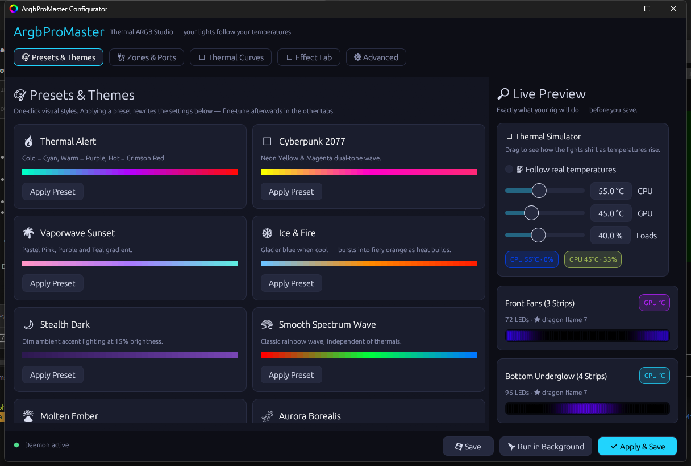
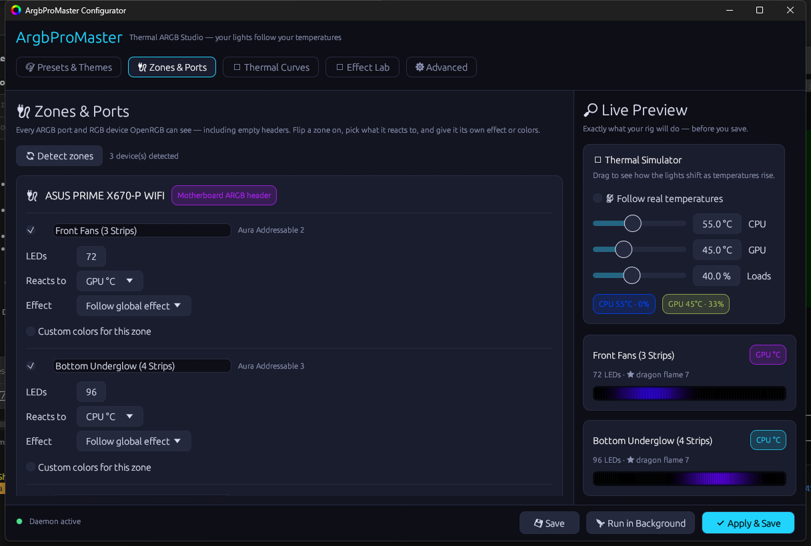
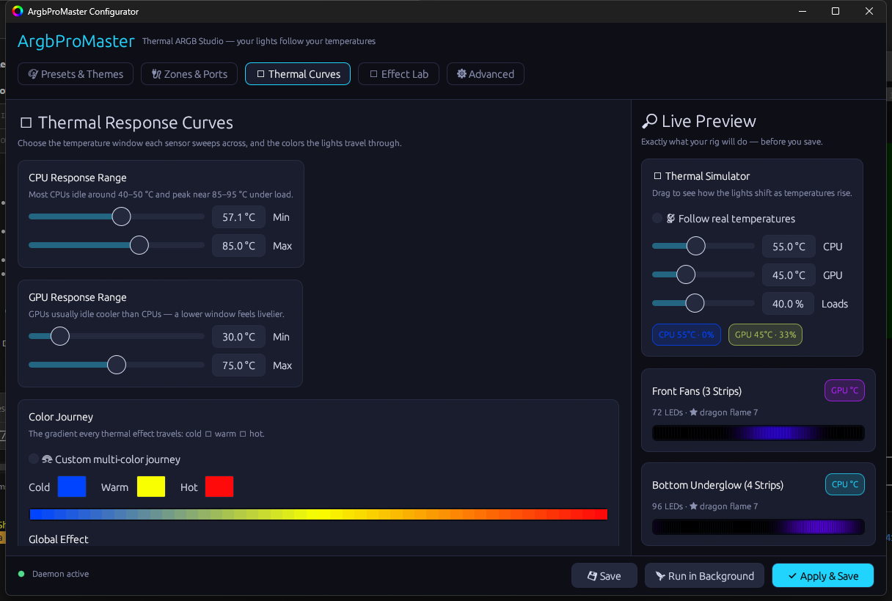
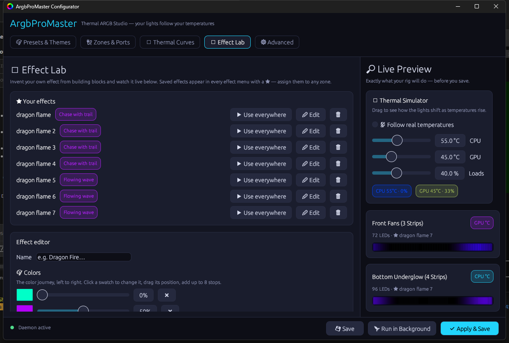

# ArgbProMaster 🌡✨

**Thermal-reactive ARGB lighting for Windows — your lights follow your temperatures.**

ArgbProMaster turns any lighting OpenRGB can control — motherboard ARGB
headers, RAM sticks, GPU zones, LED strips, keyboards — into a live display of
your system: temperatures, loads, RAM use, even framerate. A tiny background
daemon renders it all; a friendly dark-themed GUI configures it with a live
preview that is **pixel-identical** to your LEDs.

---

## 📸 A look inside

| 🔌 Every zone, auto-detected | 🌡 Curves, colors & idle |
|---|---|
|  |  |

---

## 🚀 Install (the easy way)

**Download `ArgbProMaster-Setup.exe` from the
[latest release](https://github.com/kosherplay-betatester/ArgbProMaster/releases/latest)
and run it. That's the whole tutorial.**

The installer handles everything, A to Z — each step is a checkbox:

1. Installs the app (Start Menu + optional Desktop shortcut, clean uninstaller).
2. **Installs OpenRGB for you** (via winget; skipped if you have it) — the
   engine that talks to your LEDs.
3. **Installs MSI Afterburner for you** (recommended; provides CPU/GPU
   temperatures — without it, animations keep running on last-known values).
4. **Configures OpenRGB to start with Windows** the right way: as admin with
   its SDK server on, via a scheduled task — so there's **no UAC prompt at
   login** and RAM/SMBus devices work.
5. Sets the lighting daemon to start with Windows, starts everything, and
   launches the configurator.

First run: the app auto-detects your zones. Flip them on in **🔌 Zones &
Ports**, click a preset, press **✔ Apply & Save**. Done — your lights are
thermal-reactive, permanently. If anything is ever missing (OpenRGB closed,
Afterburner not running), a **setup assistant banner** appears in the app and
fixes it in one click.

<b>Manual install (for tinkerers)</b>

1. Install [OpenRGB](https://openrgb.org) (+ its PawnIO driver), run it **as
   administrator** with the **SDK server** started (`--server`).
2. Optionally install [MSI Afterburner](https://www.msi.com/Landing/afterburner).
3. Grab the release zip (or `cargo build --release` — Rust toolchain pinned by
   `rust-toolchain.toml`) and keep `configurator_gui.exe` and
   `thermal_daemon.exe` together. Run the configurator.
4. Autostart: shortcut to `thermal_daemon.exe` in `shell:startup`, and a Task
   Scheduler entry ("highest privileges", at logon) running
   `OpenRGB.exe --server --startminimized`.

---

## ✨ Everything it does

### Zones — any hardware, any source, any look
- **Auto-detects every zone** OpenRGB exposes, including *empty* ARGB headers
  ("💤 set a LED count to bring it to life").
- Each zone independently gets: on/off, LED count, its **component source** —
  **CPU °C, GPU °C, CPU load, GPU load, RAM use, or FPS** — its own effect,
  and its own colors. Front fans on GPU temp, underglow on CPU load, a strip
  that pulses with framerate: mix freely.
- **🎯 Per-zone everything**: the Thermal Curves tab has a scope selector —
  edit the whole rig at once (🌐 All zones), or pick one port/device and give
  it its **own multi-stop Color Journey, own effect, ⤾ reverse direction,
  own speed & intensity, and a fully independent 😴 idle setup**. One-click
  📢 buttons bring every zone back to the global look.
- Slow buses are respected automatically: GPU (I2C) and RAM (SMBus) zones are
  rate-limited so no configuration can ever destabilize the pipeline.

### 25 effects, endlessly tunable
Thermal Wave (lava-sea flow or classic wave), **Thermal Fill** (a 0–100%
thermometer along the strip), **Light Trail** (a glowing pulse orbiting the
dark strip — with Trail-length and Resolution sliders, silky smooth or
retro-stepped), **Fireworks**, **Wave Collide**, **DNA Helix** (two
intertwined color strands), **Lightning Storm** (soft blooming bolts),
**Candle Flame**, **Ocean Tide** (with a sparkling foam line), **Pendulum
Wave** (hypnotic physics), **Stardust**, **Digital Rain** (Matrix-style
drips), **Kaleidoscope**, Ember Flicker, Aurora Drift, Comet Chase, Meteor
Shower, Larson Scanner, Plasma, Starfield Twinkle, Rain Drops, Gradient
Pulse, Breathing (incl. Heartbeat), Spectrum Wave, Solid. Every effect
remembers its own **Speed / Intensity / Style variant** (🎛 Effect Tuning) —
and any zone can additionally run it reversed, faster or softer than the
rest of the rig.

### Color, beautifully correct
- **Color Journey**: the classic cold→warm→hot trio, or a **custom gradient
  with up to 8 stops** placed anywhere along the range — globally, per zone,
  and even separately for the idle look.
- **Gamma-correct pipeline**: all gradients and fades blend in linear light —
  luminous midpoints, never muddy.

### Smooth by construction — and seizure-safe
- **Jump-free thermal clocks**: animations *accelerate* with heat but can
  never skip or teleport, even under sudden temperature spikes (integrated
  per-sensor phase, not `time × speed`).
- **Slow crossfades** (0.2–5 s, default 1.5 s) whenever the look changes —
  idle kicking in, presets, effect or color switches. Never a hard cut.
- **Idle-boundary hysteresis** so a temperature hovering at the edge of the
  idle range can't strobe the look.
- **Photosensitive-safety limiter**: a final output stage caps how fast any
  LED can change (full black↔white ≥ 0.35 s). Strobe-like flashing is
  physically impossible, whatever happens upstream.

### 😴 Idle Effect
Pick a range (e.g. 35–50 °C) and a calmer look — with its **own effect, own
colors (a classic trio or a full multi-color journey), and own
speed/intensity**. The moment a zone's sensor rests inside the range, it
settles into the idle look; heat up and it melts back. And with the 🎯 scope
selector, any zone can carry a **completely independent idle setup** — its
own range and look, or no idle at all — while the rest follow the global one.

### 🧪 Effect Lab
Build your own effects from blocks: multi-stop palette, six motion types
(flow / fill / chase / flicker / breathe / still), sparkle overlays, and a
temperature binding (colors follow temp / speed follows temp / fill = temp /
ignore). Live preview inside the editor; saved effects appear in every menu
with a ★.

### Presets & daily use
- **15 built-in presets** (Thermal Alert, Molten Ember, Aurora Borealis,
  Comet Storm, Cyberpunk 2077, Vaporwave Sunset, Ice & Fire, Stealth Dark,
  Smooth Spectrum Wave, 💻 Matrix Code, 🌊 Deep Ocean, 🕯 Candlelight,
  ⛈ Thunderstorm, ✨ Galaxy Dust, 🧬 Double Helix) + unlimited **custom
  presets** snapshotting your entire setup — **✔ Apply & Save offers to save
  one every time**.
- **Live preview** with mock temperature sliders (test a 95 °C meltdown
  without heating your PC) or **📡 Follow real temperatures** for a preview in
  perfect lockstep with your LEDs.
- **Tray quick menu**: switch effects on the fly, quit with lights running,
  or stop everything.
- **Safety net** (⚙ Advanced): **🔧 Fix My RGB** (one click back to a
  known-good working state), **♻ Reset to Defaults** (keeps zones & presets),
  **💡 Restore original lighting** (hand every device back to its built-in
  firmware effect — the look it shipped with).

### Honest engineering
Native Rust, no Electron. Measured on a Ryzen 7950X3D: the daemon streams 168
LEDs at 30 FPS using **0.024% CPU and 4.7 MB RAM**. Identical frames are
deduplicated, settings save atomically and hot-reload live, crashes log their
own cause, and an unsustainable frame rate is reported in plain language.

---

## 🕹 Using the app

| Tab | What you do there |
|---|---|
| 🎨 **Presets & Themes** | One-click looks; save/load/delete your own. |
| 🔌 **Zones & Ports** | Everything detected on your system. Per zone: enable, LED count, component source, effect (builtin or ★ custom), colors. "🔄 Detect zones" rescans any time. |
| 🌡 **Thermal Curves** | Pick a 🎯 scope first: 🌐 All zones edits the temperature windows, the Color Journey (3 colors or up to 8 stops), the global effect, 😴 Idle Effect and 🎛 per-effect tuning — or select one zone and give it its own journey, effect, ⤾ direction, pace and idle setup. |
| 🧪 **Effect Lab** | Invent, edit and manage your ★ custom effects. |
| ⚙ **Advanced** | FPS, easing, transition time, brightness with a 70% Safety Power Lock, daemon controls, the safety-net buttons, settings folder, and 🌐 Help. |

**Bottom bar**: 💾 Save (apply live, keep the window), 🚀 Run in Background,
✔ Apply & Save (applies everything + offers a preset + slips to the tray).
A green dot = daemon active; a yellow chip = unsaved changes.

---

## 🆘 Help & troubleshooting

| Symptom | Fix |
|---|---|
| **Anything feels broken** | ⚙ Advanced → **🔧 Fix My RGB**. |
| No zones found | OpenRGB isn't running with its SDK server — the in-app banner offers to start or install it. |
| RAM sticks missing | OpenRGB must run as administrator (the installer's scheduled task does this). |
| Colors don't follow temps | Is MSI Afterburner running? (Banner offers to start/install it.) |
| LEDs frozen after quitting | Devices hold their last frame in Direct mode — restart the daemon, or 💡 Restore original lighting. |
| Want the factory rainbow back | ⚙ Advanced → **💡 Restore original lighting**. |
| Anything else | Check `%APPDATA%\ArgbProMaster\daemon.log` — the daemon explains itself — and open an issue with it attached. |

Settings live in `%APPDATA%\ArgbProMaster\settings.json` (your presets are
inside it — back up that one file to keep everything). Diagnostics:
`cargo run -p thermal_daemon --example probe` lists every controller/zone;
`--example paint` colors each zone distinctly to identify physical ports.

---

## 🏗 Architecture

| Piece | Role |
|---|---|
| `argb_core` | Settings schema (+migrations), the deterministic gamma-correct animation engine, zone discovery, OpenRGB SDK client, Afterburner reader. Shared by both binaries so the preview matches the LEDs exactly. |
| `thermal_daemon` | Invisible renderer: sensors → smoothing → integrated thermal clocks → effects → crossfades → safety limiter → per-bus-limited writes to OpenRGB. Single-instance, auto-reconnecting, hot-reloading. |
| `configurator_gui` | The egui control panel + live preview + tray. |
| `installer/` | Inno Setup one-click installer (`ISCC.exe installer\ArgbProMaster.iss` after a release build). |

## Contributing & License

PRs welcome — see [CONTRIBUTING.md](CONTRIBUTING.md) and
[CHANGELOG.md](CHANGELOG.md). Golden rules: the engine stays deterministic,
blending stays gamma-correct, and the photosensitive-safety limiter is
untouchable. MIT — see [LICENSE](LICENSE).
